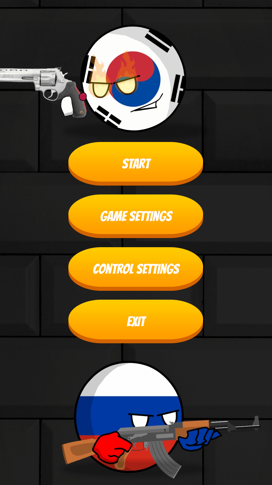
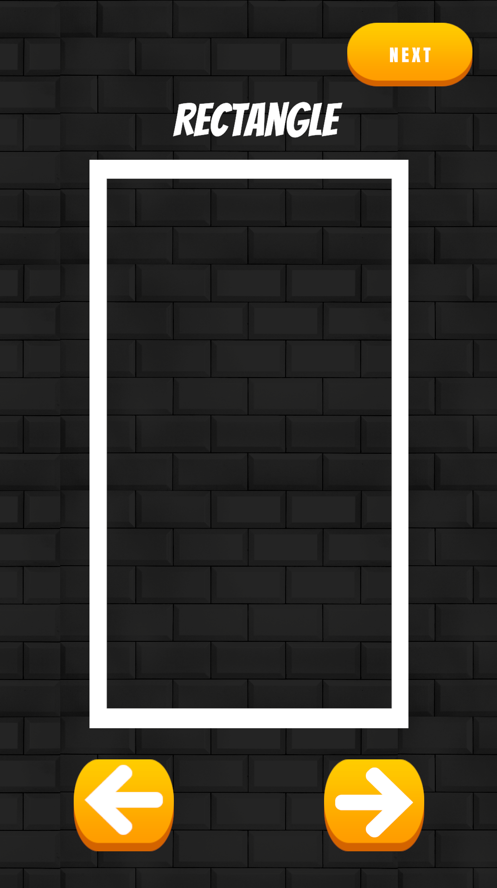
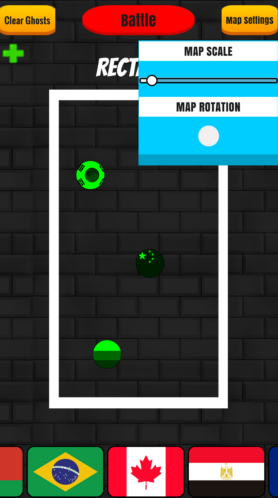
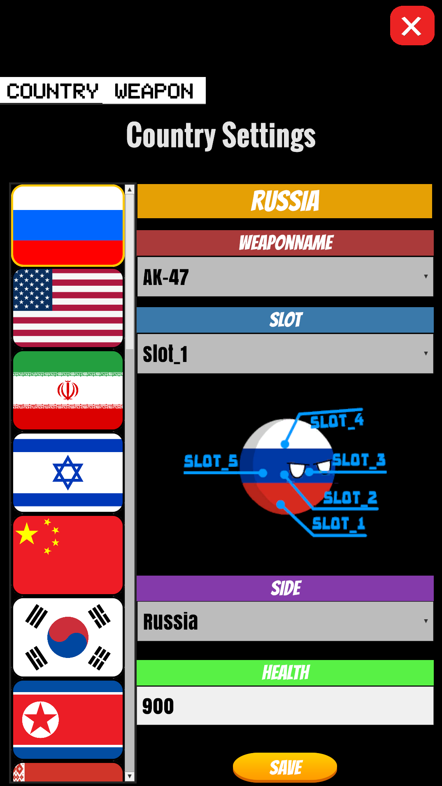
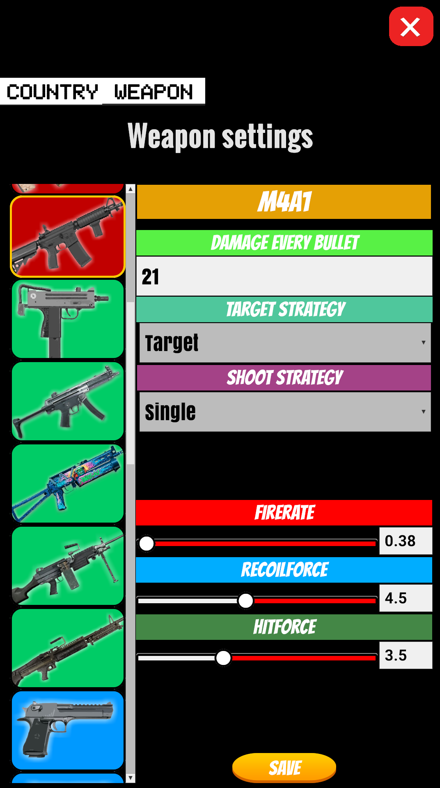
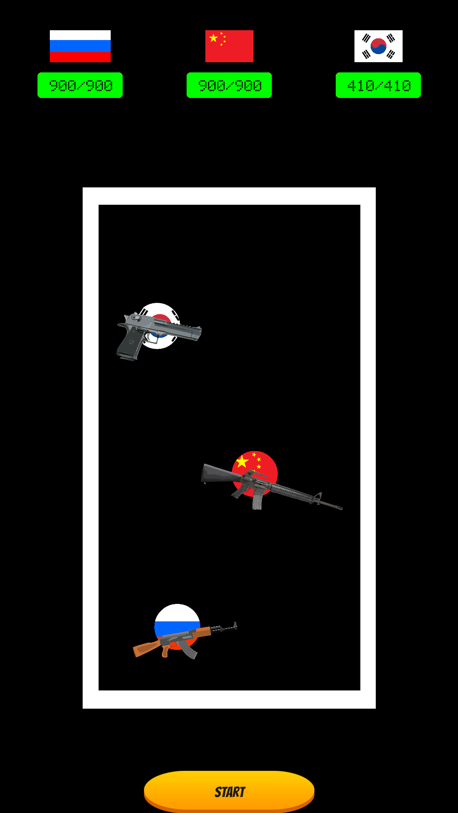

# Countryballs Battle
Конструктор сражений между странами-шарами. Выбери сторону, настрой оружие и запусти битву!

<h2 align="center" style="font-weight: bold; font-size: 18px; margin-bottom: 30px;">🎮 Скриншоты</h2>

    
    
    
    
    
    

<h2 align="center" style="font-weight: bold; font-size: 18px; margin-bottom: 30px;">✨ Особенности</h2>

- 🎯 **Конструктор битв** — настрой страну, оружие, здоровье и наблюдай
- 🔫 **Гибкая система оружия** — новое оружие добавляется за 5 минут
- 📱 **Кроссплатформа** — ПК, Android, WebGL (Яндекс Игры)
- 🌍 **26 стран** и **26 видов оружия** со своими стратегиями

- <h2 align="center" style="font-weight: bold; font-size: 18px; margin-bottom: 30px;">🛠️ Технологии</h2>

- **Unity** (C#, UI Toolkit)
- **Reflex** (DI)
- **R3** (реактивные стримы)
- **UniTask** (асинхронность)
- **JSON/PlayerPrefs** (сохранения)
- **Паттерны:** Strategy, Factory, ObjectPool, StateMachine, EventBus, MVP

<h2 align="center" style="font-weight: bold; font-size: 18px; margin-bottom: 30px;">🚀 Как запустить</h2>

<ol>
  <li>Клонируй репозиторий</li>
  <li>Открой в Unity (версия 6.3 или выше)</li>
  <li>Установи зависимости:
    <ul>
      <li><b>R3</b> — <a href="https://github.com/Cysharp/R3">github.com/Cysharp/R3</a></li>
      <li><b>UniTask</b> — <a href="https://github.com/Cysharp/UniTask">github.com/Cysharp/UniTask</a></li>
      <li><b>Reflex</b> — <a href="https://github.com/gustavopsantos/reflex">github.com/gustavopsantos/reflex</a></li>
      <li><b>DOTween</b> — Установи через Asset Store (бесплатно)</li>
    </ul>
  </li>
  <li>Открой сцену <code>SampleScene</code></li>
  <li>Жми Play</li>
</ol>

<h2 align="center" style="font-weight: bold; font-size: 18px; margin-bottom: 30px;">🔗 Ссылки</h2>

- [Яндекс Игры](позже)
- [PC\Android] (https://github.com/AsphodelWe/BallsGame/releases)
- [YouTube-канал с анимацией]([ссылка](https://www.youtube.com/@BallsBattle-g3u))

  -----------------------------------------------------------------------------------------

  <h2 align="center" style="font-weight: bold; font-size: 18px; margin-bottom: 30px;">📖 Гайды по расширению</h2>

<h2 align="center" style="font-weight: bold; font-size: 18px; margin-bottom: 30px;">🌍 Добавление страны</h2>

<h3 align="center" style="font-weight: bold; font-size: 14px; margin-bottom: 20px;">🖼️ Спрайты</h3>
<ol>
  <li>Добавь спрайт флага в общий Tile-спрайт <code>CountryFlagList.png</code> или отдельным файлом ~600×400.</li>
  <li>Добавь спрайт шара в общий Tile-спрайт <code>CountryBallsList.png</code> или отдельным файлом ~410×410.</li>
  <li>(Опционально) Для UI добавь спрайт-пример со слотами для оружия под нужную страну ~300×300.</li>
</ol>

<h3 align="center" style="font-weight: bold; font-size: 14px; margin-bottom: 20px;">🧱 Префабы</h3>
<ol start="4">
  <li>Скопируй префаб любой страны в <code>Assets/_Project/Prefabs/Country/Prew</code>, замени спрайт, переименуй.</li>
  <li>Скопируй префаб любой страны в <code>Assets/_Project/Prefabs/Country/Battle</code>, замени спрайт, переименуй.</li>
</ol>

<h3 align="center" style="font-weight: bold; font-size: 14px; margin-bottom: 20px;">🛠️ Конфиги</h3>
<ol start="6">
  <li>Скопируй конфиг <b>ФИЗИКИ</b> любой страны в <code>Assets/_Project/Configs/Country/Physics</code>, настрой, переименуй.</li>
  <li>Скопируй конфиг <b>СТАТОВ</b> любой страны в <code>Assets/_Project/Configs/Country/Stats</code>, настрой, переименуй.</li>
  <li>(Опционально) Скопируй конфиг <b>СТОРОНЫ</b> любой страны в <code>Assets/_Project/Configs/Side/CountrySide</code>, настрой, переименуй.</li>
  <li>Скопируй конфиг любой страны в <code>Assets/_Project/Configs/Country</code>. Переименуй, заполни поля созданными выше спрайтами/конфигами. Заполни <b>Default</b> (Attacker, Slot, Side).</li>
  <li>Добавь конфиг в <code>CountryDatabase</code> в <code>Assets/_Project/Configs/Main</code>.</li>
</ol>

✅ Готово! Новая страна появится в меню выбора и будет участвовать в битвах.

<h2 align="center" style="font-weight: bold; font-size: 18px; margin-bottom: 30px;">🔫 Добавление оружия</h2>

<h3 align="center" style="font-weight: bold; font-size: 14px; margin-bottom: 20px;">🖼️ Спрайты</h3>
<ol>
  <li>Добавь спрайт оружия (дуло смотрит направо) в <code>Assets/_Project/Sprites/Weapons</code>. Рекомендуемый размер: ~1000×300.</li>
  <li>Добавь спрайт UI-кнопки оружия в <code>Assets/_Project/Sprites/WeaponsIcon</code>. Рекомендуемый размер: ~400×250.</li>
</ol>

<h3 align="center" style="font-weight: bold; font-size: 14px; margin-bottom: 20px;">🧱 Префабы</h3>
<ol start="3">
  <li>Скопируй префаб любого оружия в <code>Assets/_Project/Prefabs/Weapons</code>. Замени спрайт, переименуй. Подгони Scale (по умолчанию ~0.15×0.15). Установи <code>FirePoint</code> на дуло.</li>
</ol>

<h3 align="center" style="font-weight: bold; font-size: 14px; margin-bottom: 20px;">🛠️ Конфиги и стратегии</h3>
<ol start="4">
  <li>Скопируй конфиг любого оружия в <code>Assets/_Project/Configs/Weapons</code>. Переименуй, заполни поля <code>Name</code>, <code>Prefab</code>, <code>ImageUI</code>.</li>
  <li>Создай папку для стратегий нового оружия в <code>Assets/_Project/Configs/Weapons/Strategy/WeaponStrategy</code>.</li>
  <li>Создай боевые стратегии, которые может реализовать оружие. <code>Create → ScriptableObject → Burst/Auto/Single/Shotgun/Sniper...Config</code>. Настрой параметры.</li>
  <li>Вернись к конфигу оружия. Добавь созданные стратегии в поле <code>Modules</code>. Укажи <code>Active Weapon Type</code> — базовую стратегию.</li>
  <li>Добавь конфиг нового оружия в <code>AttackerData</code> (<code>Assets/_Project/Configs/Main</code>).</li>
</ol>

💡 <b>Вместо шагов 5–6</b> можешь просто скопировать любую стратегию из другого оружия и поменять параметры, если необходимо.

Готово! Любая страна сможет взять в руки твоё новое оружие!

  
